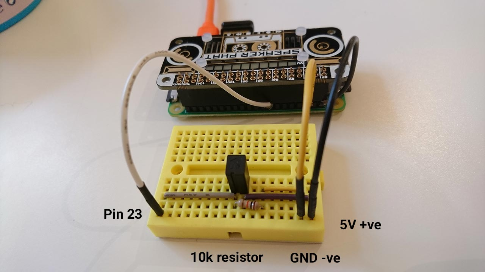

# JamBot

A Raspberry Pi-powered JamBot that plays stupid sound clips when touched in a special place.

It also listens to a [server](https://github.com/studio-awkward/jambot-server) via websockets for remotely triggering sound clips.

## Construction

This uses a Raspberry Pi Zero and a Speaker pHAT.

* Set up the pHAT: https://learn.pimoroni.com/tutorial/sandyj/assembling-speaker-phat

* Add a sensor; this uses a button switch but this could easily be replaced with a tilt switch or similar.

  Wires were wrapped around the header pins 5V, Ground and input 23 for the switch.



## Code

* Install the software by following these instructions: https://github.com/pimoroni/speaker-phat

* Optional step - also install airdac:

  ```
  curl -sS get.pimoroni.com/airdac | bash
  ```

* Install mpg321 to play mp3s:

  ```
  sudo apt-get install mpg321
  ```

* Check this repo out onto the pi

* Update the config file to point to the websocket [server](https://github.com/studio-awkward/jambot-server)

* Set up the script to run on boot by editing the following file:

  ```
  sudo nano /etc/rc.local
  ```

  Add to the bottom of the file:

  ```
  # jambot
  python /home/pi/jambot/jambot.py &
  python /home/pi/jambot/jambot-sockets.py &
  ```

* Or alternatively, copy and enable the two service files:

  ```
  sudo cp jambot.service /lib/systemd/system/
  sudo cp jambot-sockets.service /lib/systemd/system/
  sudo systemctl enable jambot.service
  sudo systemctl enable jambot-sockets.service
  ```

## Misc

Add .mp3 files to the `sfx` directory.

To adjust the volume control:

```
$ alsamixer
```
